# Projeto_Micromobilidade_urbana

**Nathan Vespasiano Fonseca** RA: 22.124.086-4

**Felipe Da Rocha Pinheiro**

**Fernando Domingues**

# Diagrama de Casos de Uso

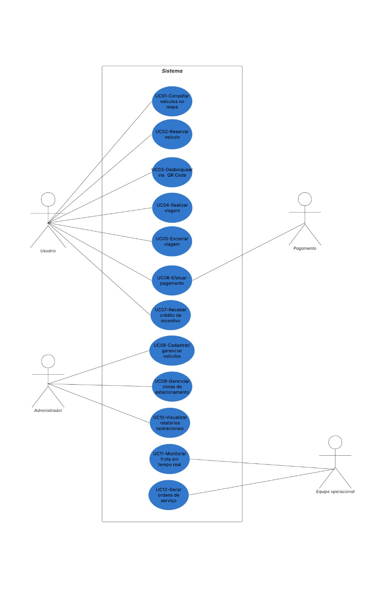

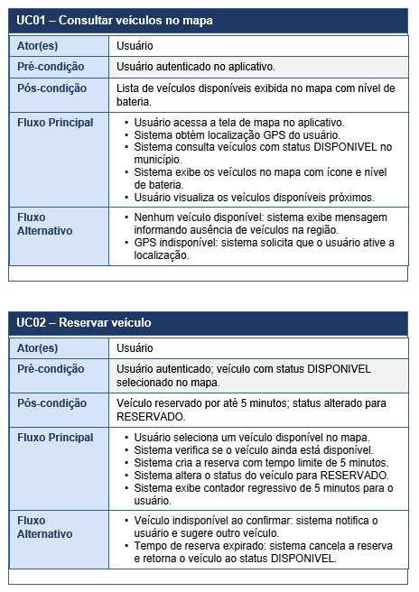

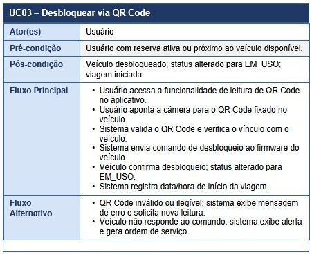

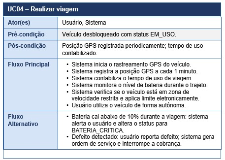

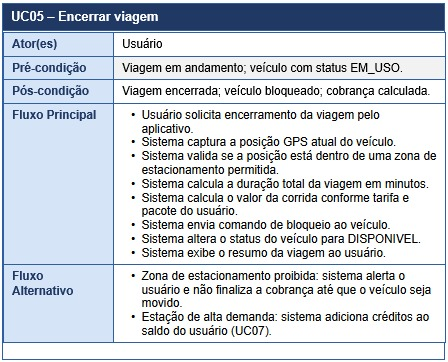

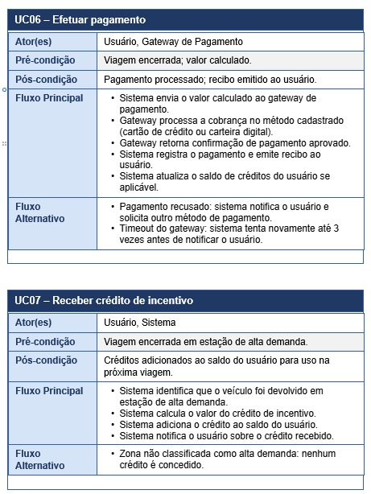

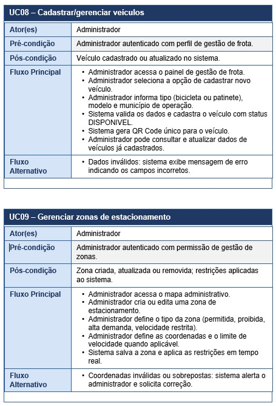

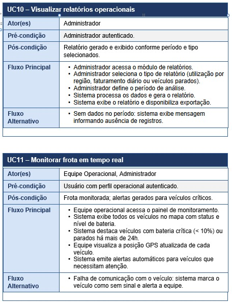

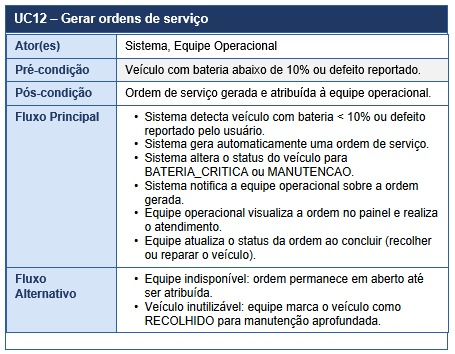

# Diagrama de Classes

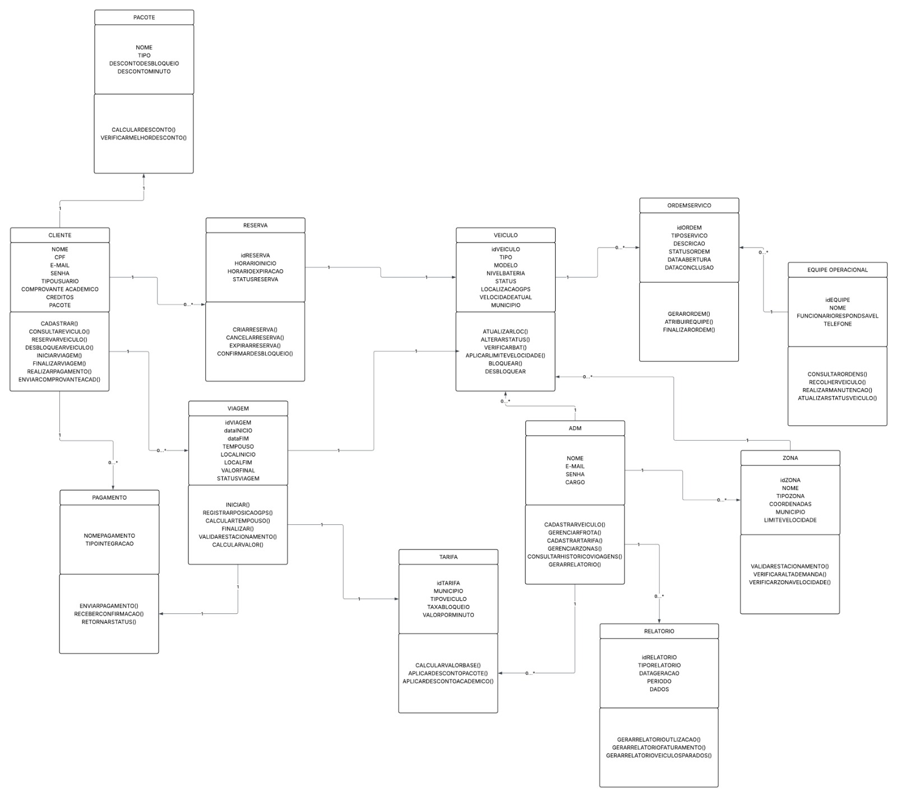

# Diagrama de Sequência

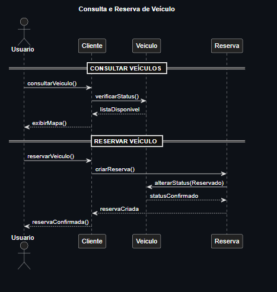

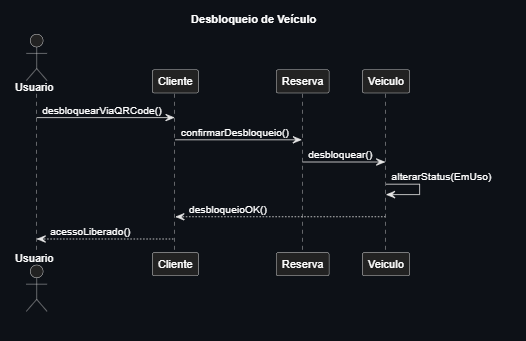

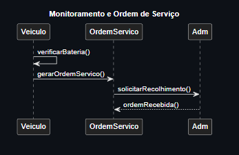

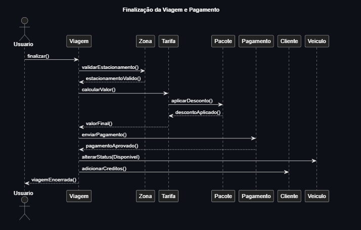
